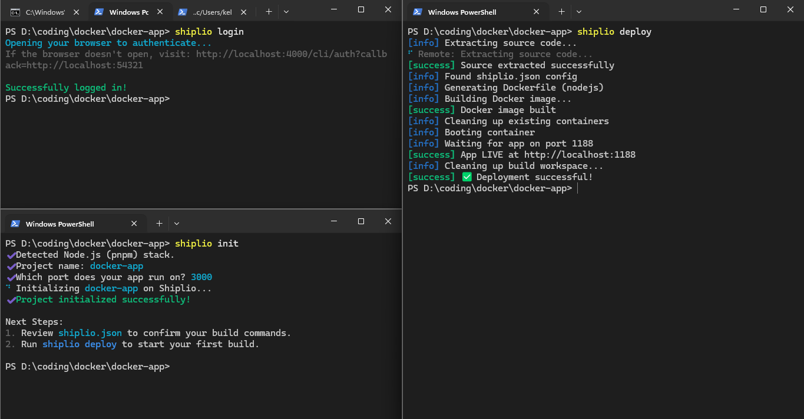
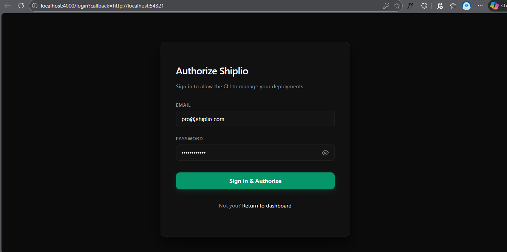
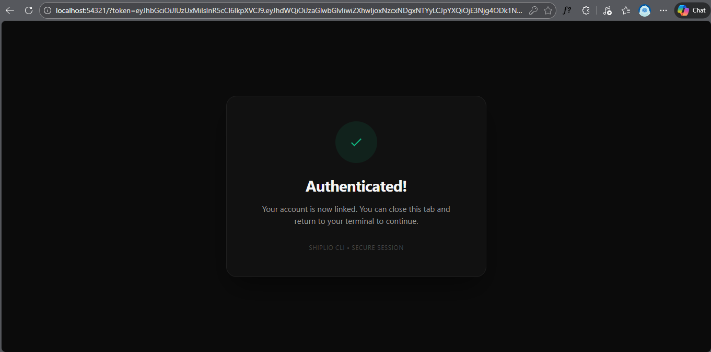
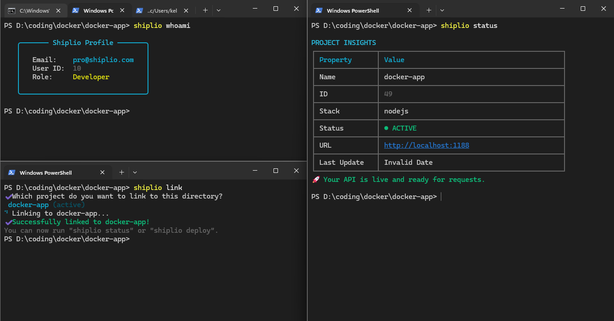
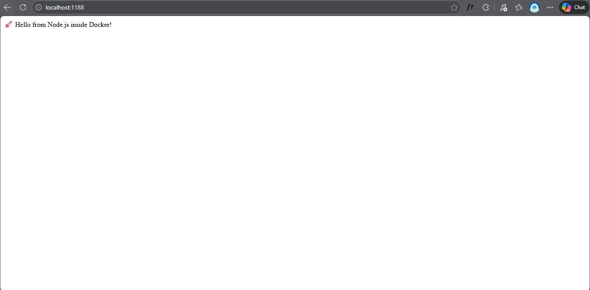

# Shiplio

**Shiplio** is a high-performance PaaS (Platform as a Service) built for developers who crave a refined terminal experience and rapid deployment cycles. By combining a robust **Elixir/Phoenix** engine with a modern **Node.js** CLI, Shiplio automates the journey from local source code to live Docker containers.

---

## Preview

### The Core Workflow

*A seamless flow showing browser-based authentication, project initialization, and a real-time Docker build stream directly in your terminal.*

### Secure Authentication (Opened automatically after running `shiplio login` )

*A secure "Local Loopback" auth pattern that bridges your terminal to a web-based login, ensuring credentials remain encrypted and secure.*

### After Successful Login

*Once authorized, the Auth Bridge securely transmits the JWT back to your local CLI server, automatically closing the loop and readying your environment for immediate deployment*

### Project Insights & Linking

*Use the CLI to link existing directories to your Shiplio account and view rich metadata, including deployment status and live URLs, using a structured TUI.*

*Note: We are currently transitioning from localhost port mapping to a custom sub-domain system (e.g., example.shiplio.com) via an integrated reverse proxy.*

### Live Deployments

*The end result: your application running inside a Docker container, accessible via a dynamically assigned local port.*

---

## Quick Start

### Engine (Backend)
```bash
cd apps/engine
mix deps.get && mix ecto.setup
mix phx.server
```

### CLI
```bash
cd apps/cli
pnpm install && pnpm link --global
shiplio login
```

---

## Commands

- `shiplio login` / `logout` - Manage authentication.
- `shiplio init` - Initialize a new project.
- `shiplio whoami` - Displays account details for the currently authenticated user.
- `shiplio deploy` - Deploy to the cloud.
- `shiplio status` - View app health and metrics.
- `shiplio logs` - Stream application logs.
- `shiplio link` - Connects a local directory to an existing project on your account.

## License

MIT