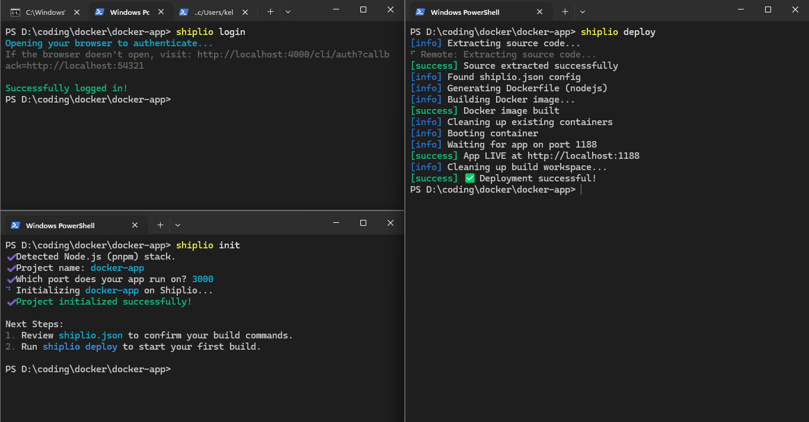
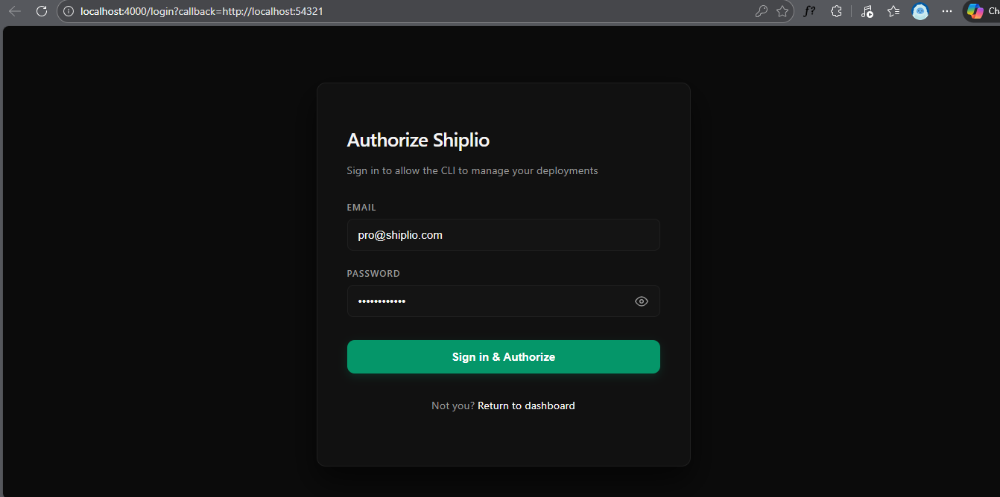
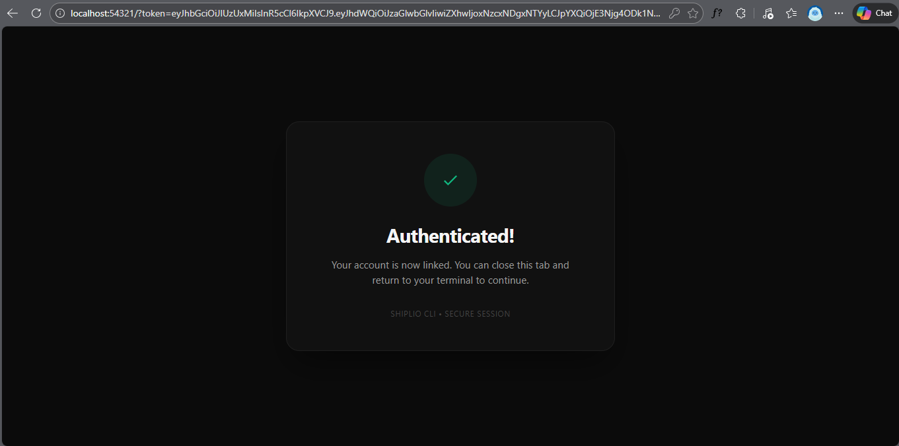
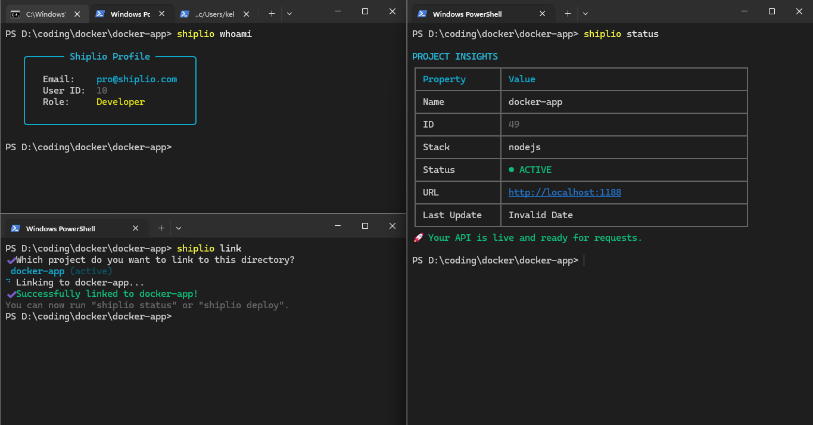
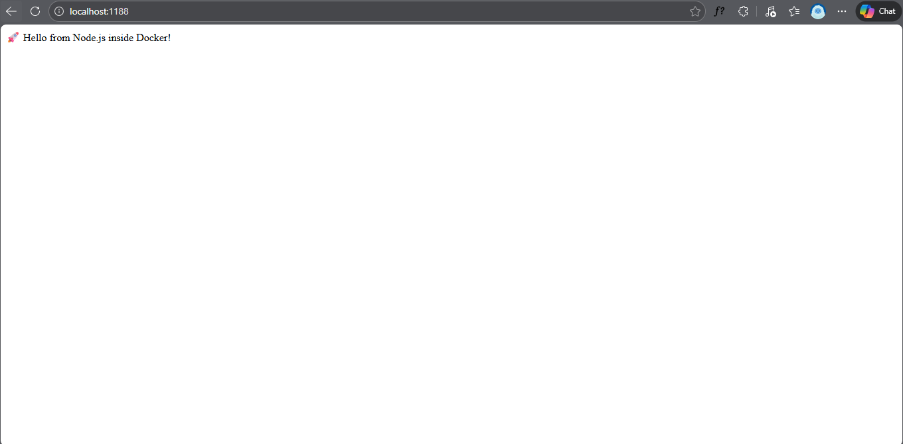

# Shiplio

**Shiplio** is a high-performance PaaS (Platform as a Service) built for developers who crave a refined terminal experience and rapid deployment cycles. By combining a robust **Elixir/Phoenix** engine with a modern **Node.js** CLI, Shiplio automates the journey from local source code to live Docker containers.

---

## Preview

### The Core Workflow

*A seamless flow showing browser-based authentication, project initialization, and a real-time Docker build stream directly in your terminal.*

### Secure Authentication (Opened automatically after running `shiplio login` )

*A secure "Local Loopback" auth pattern that bridges your terminal to a web-based login, ensuring credentials remain encrypted and secure.*

### After Successful Login

*Once authorized, the Auth Bridge securely transmits the JWT back to your local CLI server, automatically closing the loop and readying your environment for immediate deployment*

### Project Insights & Linking

*Use the CLI to link existing directories to your Shiplio account and view rich metadata, including deployment status and live URLs, using a structured TUI.*

*Note: We are currently transitioning from localhost port mapping to a custom sub-domain system (e.g., example.shiplio.com) via an integrated reverse proxy.*

### Live Deployments

*The end result: your application running inside a Docker container, accessible via a dynamically assigned local port.*

---

## Local Setup

### Prerequisites
- **Node.js** 18+ (for CLI)
- **Elixir** 1.14+ (for Engine)
- **PostgreSQL** 14+ (for database)
- **Docker** (for containerization and running user apps)
- **Caddy** (reverse proxy for routing and SSL)
- **pnpm** (package manager for CLI)

### Backend Setup (Engine)

```bash
# Navigate to engine directory
cd apps/engine

# Install Elixir dependencies
mix deps.get

# Setup database
mix ecto.setup

# Run the Phoenix server
mix phx.server
```

The engine will start on `http://localhost:4000`

### Docker & Caddy Setup

**Docker** is used to containerize user deployments. Make sure the Docker daemon is running:

```bash
# On Windows/Mac, start Docker Desktop or run:
docker --version  # Verify Docker is installed
```

**Caddy** acts as a reverse proxy for routing deployed applications:

```bash
# Install Caddy (if not already installed)
# On Windows with Chocolatey:
choco install caddy

# On Mac with Homebrew:
brew install caddy

# On Linux:
sudo apt-get install caddy

# Start Caddy with the project config:
cd apps/engine
caddy run --config Caddyfile
```

Caddy will read the `Caddyfile` in the engine directory and handle routing for deployed apps.

### CLI Setup

```bash
# Navigate to CLI directory
cd apps/cli

# Install Node dependencies
pnpm install

# Link CLI globally (for testing)
pnpm link --global

# Verify installation
shiplio --version
```

### Testing the Platform

You'll need 3 terminals running:

**Terminal 1 - Start the Engine:**
```bash
cd apps/engine
mix phx.server
```
Engine runs on `http://localhost:4000`

**Terminal 2 - Start Caddy (Reverse Proxy):**
```bash
cd apps/engine
caddy run --config Caddyfile
```
Caddy handles routing for deployed applications

**Terminal 3 - Test the CLI:**
```bash
shiplio login
# Opens browser for authentication
```

Once authenticated, try deploying an example:
```bash
cd examples/node
npm install
shiplio init
shiplio deploy
```

Monitor your deployment:
```bash
shiplio status
shiplio logs
```

Docker containers will be created and managed automatically when you deploy.

---

## Quick Start

### Engine (Backend)
```bash
cd apps/engine
mix deps.get && mix ecto.setup
mix phx.server
```

### CLI
```bash
cd apps/cli
pnpm install && pnpm link --global
shiplio login
```

---

## Commands

### Authentication
- `shiplio login` - Login to your Shiplio account (opens browser for secure auth)
- `shiplio whoami` - Display account details for the currently authenticated user

### Project Management
- `shiplio init [projectName]` - Initialize a new Shiplio project
- `shiplio link` - Link this directory to an existing Shiplio project
- `shiplio list projects` - List all your Shiplio projects
- `shiplio destroy` - Destroy your project

### Deployment
- `shiplio deploy` - Deploy your project to Shiplio
- `shiplio status` - Get the status of your Shiplio project
- `shiplio logs [project_id]` - Stream real-time runtime logs
  - `-t, --tail <number>` - Number of lines to show from the end (default: 50)

### Container Management
- `shiplio ssh` - SSH into your running container
- `shiplio pause` - Pause your project (stop the container)
- `shiplio resume` - Resume your paused project

### Environment Variables
- `shiplio env set [vars...]` - Set environment variables (KEY=VALUE format)
- `shiplio env list` - List all environment variables
  - `-r, --raw` - Show raw environment variables
- `shiplio env push` - Push local .env file variables to the server
  - `-r, --replace` - Replace all server variables (default: merge)
- `shiplio env unset [keys...]` - Unset environment variables by keys

### Utility
- `shiplio ping` - Simple ping test to verify connection

## License

MIT