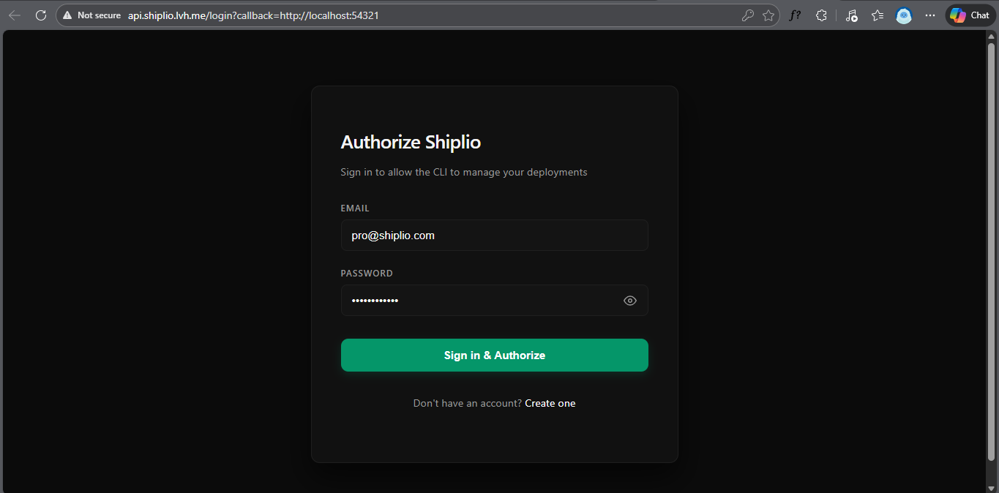
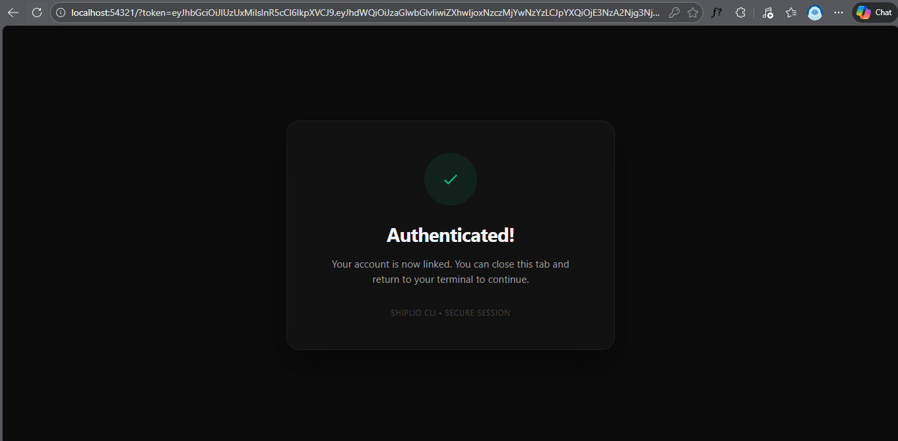
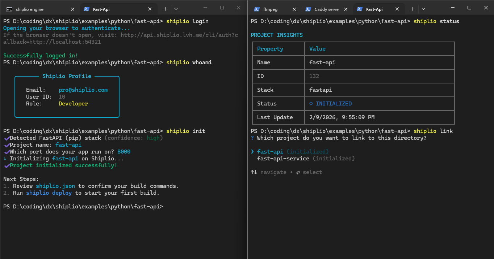
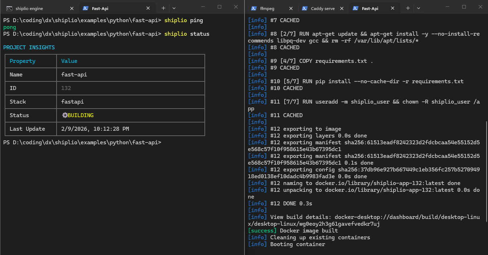
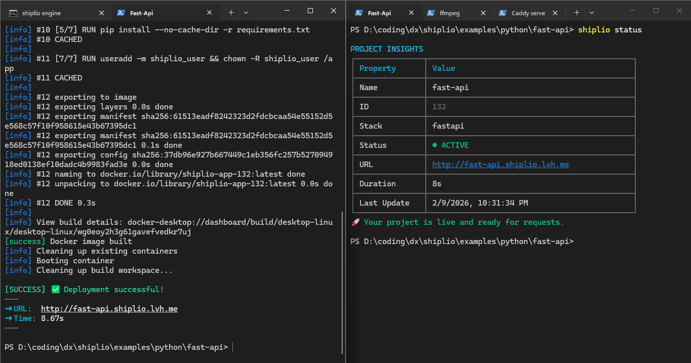
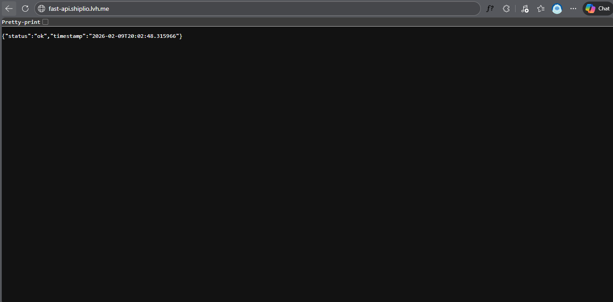
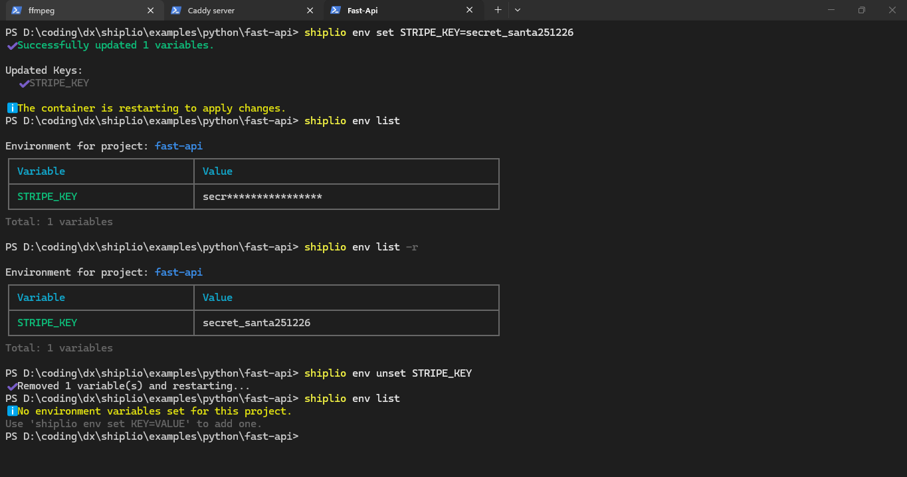
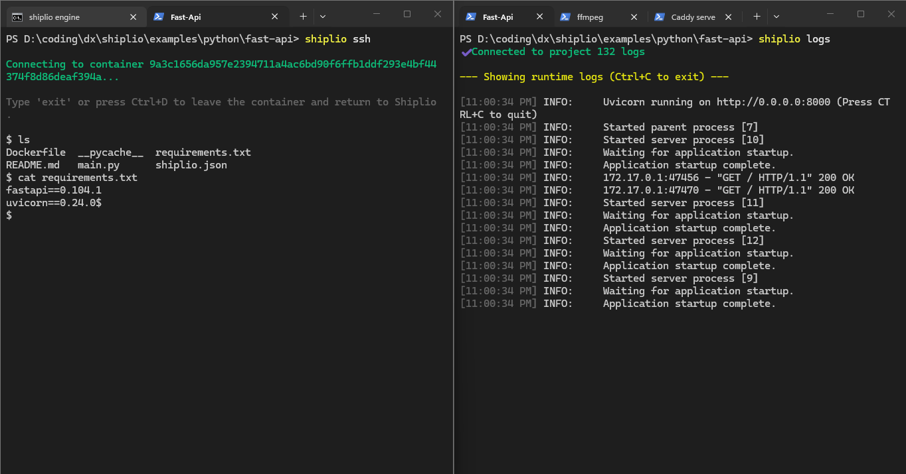
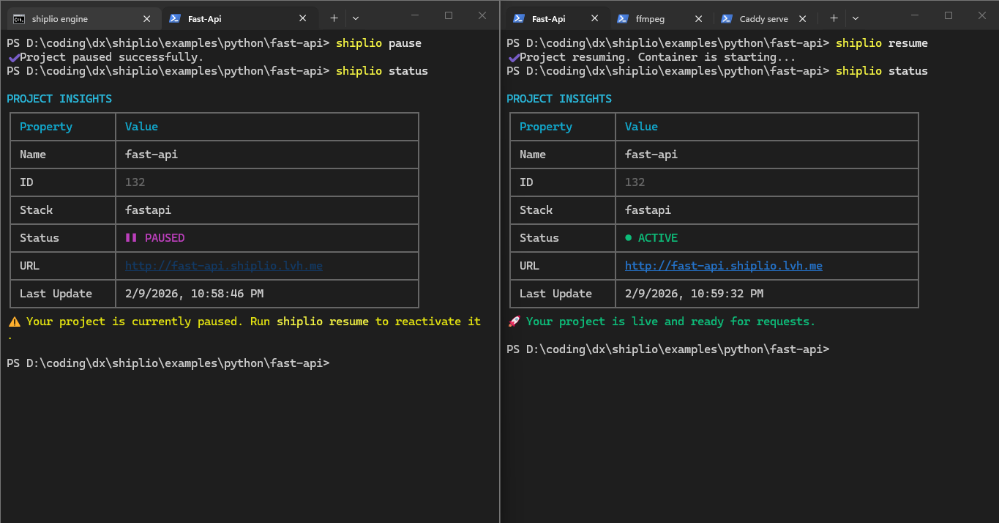

# Shiplio

**Shiplio** is a high-performance, self-hosted **PaaS (Platform as a Service)** designed for developers who love terminals, speed, and control.

It combines a **Node.js-powered CLI** with an **Elixir/Phoenix orchestration engine** to automate the full journey from **local source code → Docker container → live deployment**, all on your own infrastructure.

> **The simplicity of Vercel.  
> The control of Fly.io.  
> Running on hardware you own.**

---

## Preview

### 1. Secure Authentication

*Run `shiplio login` to launch a secure "Local Loopback" auth bridge. Credentials remain encrypted and are never stored in plain text on your machine.*

### 2. Successful Authorization

*Once authorized, the Auth Bridge securely transmits the JWT back to your local CLI server, automatically closing the loop for immediate deployment.*

### 3. Project Initialization & Insights

*Shiplio features high-confidence stack detection (Next.js, FastAPI, Elixir, etc.). Use `shiplio status` to view rich metadata and live deployment URLs.*

### 4. Real-Time Build Streaming

*Watch your deployment come to life. Shiplio streams the Docker build process directly to your terminal, providing instant feedback on layer caching and image exports.*

### 5. Deployment Successful!

*Deployment finalized. Once the container is booted and passes the health check, Shiplio provides a live `.lvh.me` URL and high-level deployment metrics.*

### 6. Running Application

*App is running and ready for requests*


### 7. Environment & Secrets Management

*Securely manage secrets with masked values. Use the `-r` flag to toggle raw visibility, or use `shiplio env push` to sync your local `.env` file automatically.*

### 8. Container Mastery (SSH & Logs)

*Deep visibility into your running apps. SSH directly into your containers for debugging or stream real-time production logs with a single command.*

### 9. Lifecycle Control

*Full control over your resources. Pause projects to save memory or resume them instantly—managed via an integrated **Caddy** reverse proxy with `.lvh.me` sub-domain routing.*

---

## Local Setup

### Prerequisites
- **Node.js** 18+ (for CLI)
- **Elixir** 1.14+ (for Engine)
- **PostgreSQL** 14+ (for database)
- **Docker** (for containerization and running user apps)
- **Caddy** (reverse proxy for routing and SSL)
- **pnpm** (package manager for CLI)


## Automatic Setup (Recommended)
Run the bootstrap script to install dependencies, link the CLI, and setup the database automatically.

**Tip**: use `--dry-run` flag to exec the setup scripts without executing any command

* **macOS/Linux/WSL2:** `./setup.sh` 
* **Windows:** `.\setup.ps1` 

**NOTE:** If your local Postgres password is not 'postgres', edit the apps/engine/.env file before running the setup script, or edit it after and run mix ecto.setup again.

---


### Manual Setup
<details>
<summary>Click to view manual installation steps</summary>

1. Install Elixir 1.15+, Node 18+, and PostgreSQL.
2. Run `mix deps.get` in `apps/engine`.
3. Create a `.env` file in `apps/engine` (see below).
4. Run `pnpm install` in `apps/cli`.

### Backend Setup (Engine)
**NOTE:** If your local Postgres password is not 'postgres', edit the apps/engine/.env file before running the setup script, or edit it after and run mix ecto.setup again.

```bash
# Navigate to engine directory
cd apps/engine

# Install Elixir dependencies
mix deps.get

# Setup database
mix ecto.setup

# Run the Phoenix server
mix phx.server
```

The engine will start on `http://localhost:4000`

### Docker & Caddy Setup

**Docker** is used to containerize user deployments. Make sure the Docker daemon is running:

```bash
# On Windows/Mac, start Docker Desktop or run:
docker --version  # Verify Docker is installed
```

**Caddy** acts as a reverse proxy for routing deployed applications:

```bash
# Install Caddy (if not already installed)
# On Windows with Chocolatey:
choco install caddy

# On Mac with Homebrew:
brew install caddy

# On Linux:
sudo apt-get install caddy

# Start Caddy with the project config:
cd apps/engine
caddy run --config Caddyfile
```

Caddy will read the `Caddyfile` in the engine directory and handle routing for deployed apps.

### CLI Setup

```bash
# Navigate to CLI directory
cd apps/cli

# Install Node dependencies
pnpm install

# Link CLI globally (for testing)
pnpm link --global

# Verify installation
shiplio --version
```

### Testing the Platform

You'll need 3 terminals running:

**Terminal 1 - Start the Engine:**
```bash
cd apps/engine
mix phx.server
```
Engine runs on `http://localhost:4000`

**Terminal 2 - Start Caddy (Reverse Proxy):**
```bash
cd apps/engine
caddy start --config Caddyfile
curl -X POST http://localhost:20200/config/apps/tls/automation/policies \
  -H "Content-Type: application/json" \
  -d '{
    "subjects": ["shiplio.lvh.me", "*.shiplio.lvh.me"],
    "issuers": [{"module": "internal"}]
  }'

# Stop the caddy server after use
caddy stop 
```
Caddy handles routing for deployed applications

**Terminal 3 - Test the CLI:**
```bash
shiplio login
# Opens browser for authentication
```
Once authenticated, try deploying an example:
</details>

---

## Example Deployments (After local setup)
```bash
cd examples/node
npm install
shiplio init
shiplio deploy
```

Monitor your deployment:
```bash
shiplio status
shiplio logs
```

Docker containers will be created and managed automatically when you deploy.

---

## Quick Start

### Engine (Backend)
```bash
cd apps/engine
mix deps.get && mix ecto.setup
mix phx.server
```

### CLI
```bash
cd apps/cli
pnpm install && pnpm link --global
shiplio login
```

---

## Commands

### Authentication
- `shiplio login` - Login to your Shiplio account (opens browser for secure auth)
- `shiplio whoami` - Display account details for the currently authenticated user

### Project Management
- `shiplio init [projectName]` - Initialize a new Shiplio project
- `shiplio link` - Link this directory to an existing Shiplio project
- `shiplio list projects` - List all your Shiplio projects
- `shiplio destroy` - Destroy your project

### Deployment
- `shiplio deploy` - Deploy your project to Shiplio
- `shiplio status` - Get the status of your Shiplio project
- `shiplio logs [project_id]` - Stream real-time runtime logs
  - `-t, --tail <number>` - Number of lines to show from the end (default: 50)

### Container Management
- `shiplio ssh` - SSH into your running container
- `shiplio pause` - Pause your project (stop the container)
- `shiplio resume` - Resume your paused project

### Environment Variables
- `shiplio env set [vars...]` - Set environment variables (KEY=VALUE format)
- `shiplio env list` - List all environment variables
  - `-r, --raw` - Show raw environment variables
- `shiplio env push` - Push local .env file variables to the server
  - `-r, --replace` - Replace all server variables (default: merge)
- `shiplio env unset [keys...]` - Unset environment variables by keys

### Utility
- `shiplio ping` - Simple ping test to verify connection

---
### Contributing
We welcome contributions! Whether it's adding a new deployment template (Ruby, Go, Rust) or improving the CLI TUI:
1. Fork the repo.
2. Create your feature branch (`git checkout -b feature/AmazingFeature`).
3. Commit your changes using [Conventional Commits](https://www.conventionalcommits.org/).
4. Push to the branch and open a Pull Request.

---
## License

MIT
